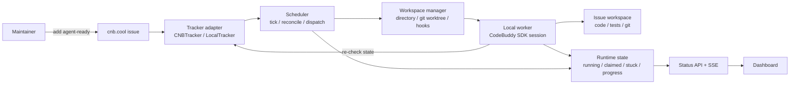
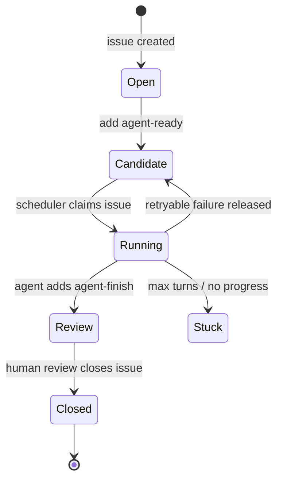
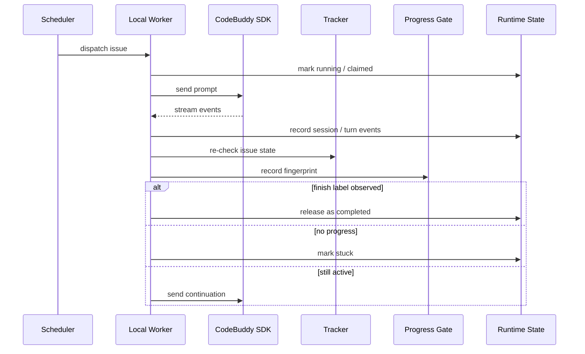
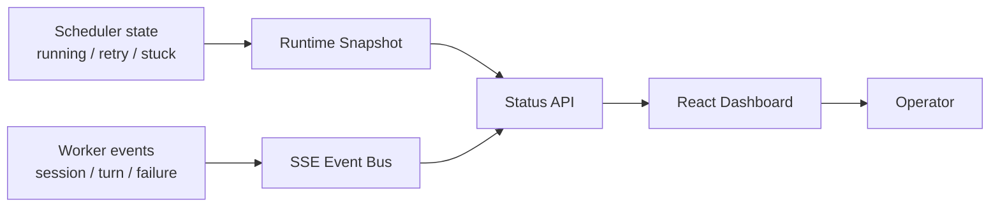
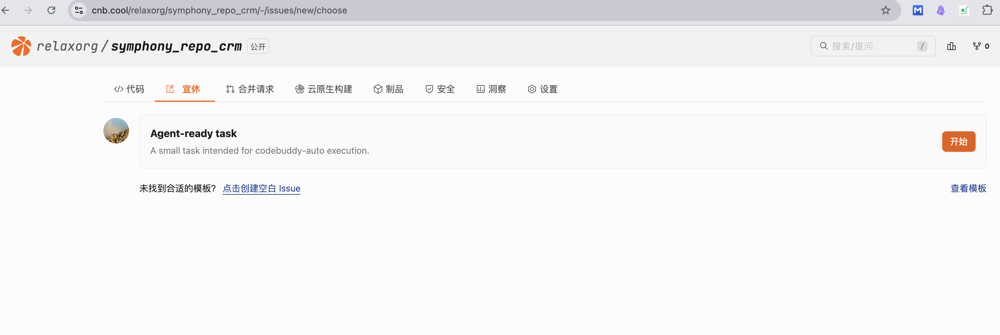
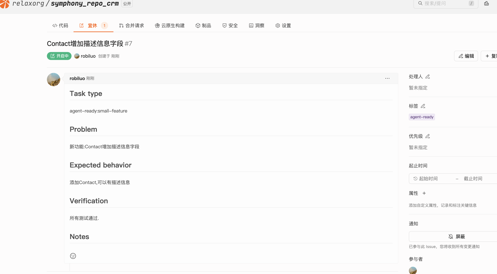
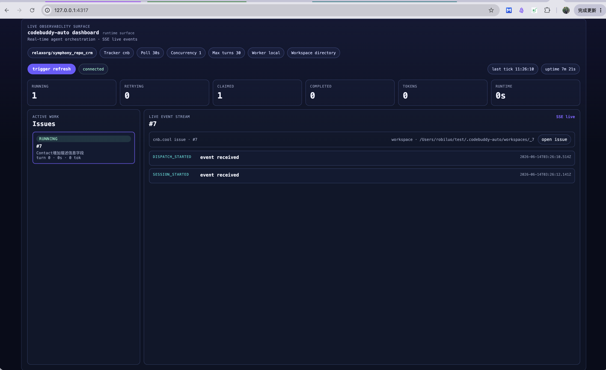
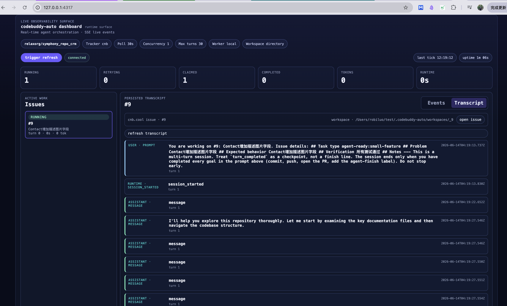
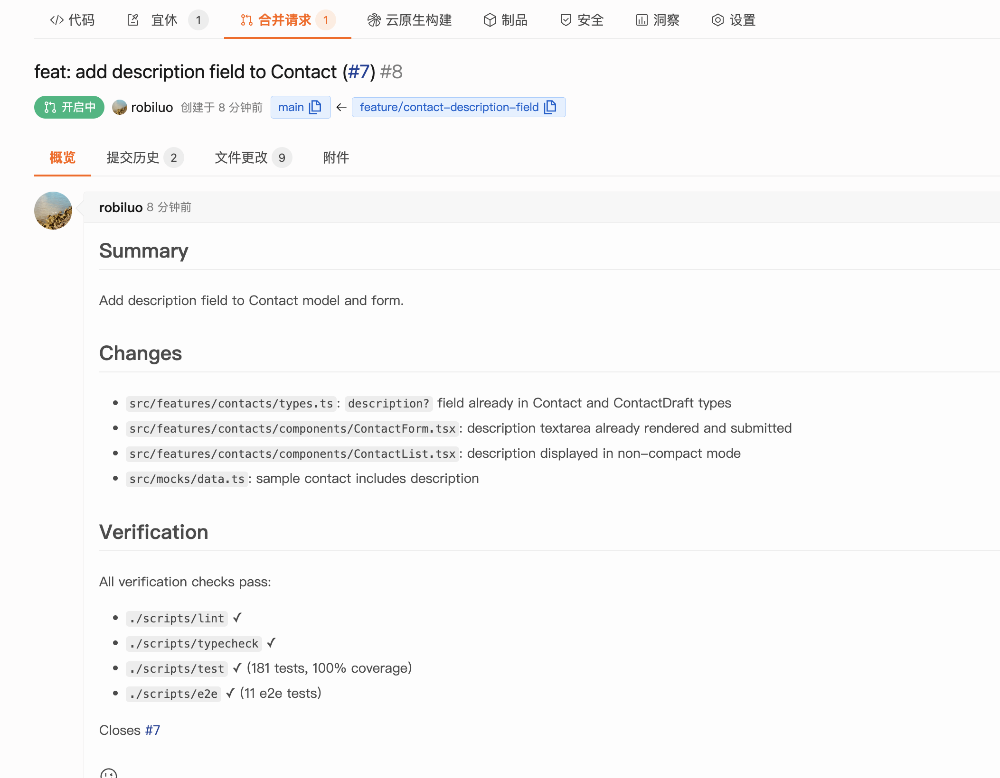

# 基于 CodeBuddy 的 Symphony 风格 issue 调度器

`codebuddy-auto` 是一个基于 CodeBuddy Agent SDK 的 issue 调度器。它参考 OpenAI Symphony 的调度语义，但实现上没有复刻 Symphony 的 Elixir/OTP 后端，而是落在 TypeScript、Node.js 和 cnb.cool issue 这组技术栈上。

它要解决的问题不是 “如何调用一次 agent”，而是把一次 issue 处理变成可调度、可观察、可恢复的运行流程：从 tracker 读取候选任务，为每个 issue 准备隔离 workspace，启动 CodeBuddy SDK 长会话，在 turn 边界检查 tracker 和 progress，并通过 Dashboard 展示实时状态和失败细节。

## 1. 为什么需要 codebuddy-auto

把 AI coding agent 接到真实仓库里，单次调用模型通常不是最麻烦的部分。更麻烦的是围绕 agent 的工程状态：

- 哪些 issue 可以交给 agent？
- 一个 issue 是否已经被当前进程 claim？
- agent 跑到一半时，issue 被人工关闭或移出队列怎么办？
- 连续几轮没有文件变化，是否还要继续自动续跑？
- 失败时只看到 `TURN_FAILED`，如何知道是 SDK、git、hook 还是验证命令出了问题？

如果只是写一个脚本，从 issue 拉标题和描述，然后调用一次 CLI，这些问题都会被推迟到运行时才暴露。`codebuddy-auto` 的出发点是把这些边界提前纳入调度器：任务候选、workspace、worker session、progress gate、handoff 和 observability 都是同一个运行模型的一部分。

## 2. 它和 OpenAI Symphony 的关系

OpenAI Symphony 提供的是一套 agent orchestration 思路：issue 是任务入口，tracker 是外部状态源，worker 在 turn 边界重新检查任务状态，系统用运行态避免重复调度，并通过 handoff 信号判断 agent 是否完成。

`codebuddy-auto` 保留这组调度语义，但换了实现环境：

| 维度 | Symphony 官方实现 | codebuddy-auto |
|---|---|---|
| 语言与运行时 | Elixir / OTP | TypeScript / Node.js |
| Agent 执行 | codex app-server | CodeBuddy Agent SDK |
| Tracker | Linear | cnb.cool issue，另有 LocalTracker fallback |
| 调度模型 | supervisor tree | scheduler tick + async worker |
| 观察面 | runtime events | status API + SSE + Dashboard |

换句话说，`codebuddy-auto` 不是 Symphony 的移植版，而是一个 TypeScript 参考实现：用 CodeBuddy SDK 和 cnb.cool issue 复现 Symphony 风格的 issue-driven 调度流程。

从核心抽象看，`codebuddy-auto` 已经具备 Symphony 的三元模型：

| 抽象 | 含义 | codebuddy-auto 当前实现 |
|---|---|---|
| 多 issue | issue 是调度单位，每个 issue 表示一份独立工作 | 从 CNB tracker 拉取多个 `agent-ready` issue，并按状态、标签和并发限制选择候选 |
| 多 workspace | workspace 是文件系统隔离边界，每个 issue 在自己的目录里执行 | 每个 issue 映射到独立 workspace，例如 `.codebuddy-auto/workspaces/_11` |
| 多 agent 并发 | agent 是执行边界，多个 issue 可以同时由不同 agent session 处理 | `agent.max_concurrent_agents` 控制并发数，local worker 为不同 issue 启动独立 CodeBuddy SDK session |

## 3. 核心设计：Issue 驱动的 Agent Orchestration

在这个模型里，issue 不是单纯的 prompt 输入，而是一个长期存在的状态锚点。

一个贴了 `agent-ready` 标签的 issue 会进入候选集。Scheduler 发现它后创建 workspace，启动 worker，并把它标记为 running。Worker 每完成一轮 turn，都会重新读取 tracker：如果 issue 离开 active state，或者出现 `agent-finish`，worker 就停止续跑并释放 claim；如果没有变化，则根据 progress gate 决定是否继续。

这个设计刻意区分两件事：

- **停止执行**：agent 达到 `max_turns`、超时、失败或无进展，调度器可以停止继续消耗资源。
- **任务完成**：agent 完成验证、commit、push，并通过 `agent-finish` 等 handoff 信号把任务交给维护者。

这两个状态不能混在一起。Agent 跑完预算，不代表代码已经能合并；Dashboard 显示 completed，也不等于目标仓库 CI 已通过。完成判断仍然应该回到 tracker、CI 和人工审核。

## 4. 整体架构

`codebuddy-auto` 的运行面如下：



几个边界比较关键：

- **Tracker**：读取外部 issue，并归一化成内部 `Issue`。
- **Scheduler**：处理 tick、reconcile、dispatch、retry 和 cleanup。
- **Workspace**：为每个 issue 准备隔离目录，并执行 hooks。
- **Worker**：持有 CodeBuddy SDK session，驱动 agent 多轮执行。
- **Runtime State**：记录当前进程看到的 running、claimed、stuck、progress 等状态。
- **Dashboard**：消费 status API 和 SSE，只观察，不参与调度决策。

Runtime state 不是数据库。进程重启后，系统不会恢复一个完全相同的 SDK session，而是重新读取 tracker 和 workspace，再判断 issue 是否仍需要处理。

## 5. 从一个 issue 到一次自动执行

默认任务流用 cnb.cool issue 标签来表达：



一条顺利的执行链路大概是：

1. 维护者创建 issue，写清需求、验收标准和验证命令。
2. 给 issue 添加 `agent-ready` 标签。
3. `codebuddy-auto daemon` 在下一轮 tick 中发现候选 issue。
4. Scheduler 创建 workspace，并执行 `after_create` / `before_run` hook。
5. Local Worker 启动 CodeBuddy SDK session，把 issue 信息和 `WORKFLOW.md` prompt 发给 agent。
6. Agent 修改代码、运行验证、commit、push。
7. Worker 在 turn 边界重新检查 tracker 和 progress。
8. Agent 添加 `agent-finish` 后，worker 释放 running claim。
9. 维护者审核 PR 或提交结果，最后关闭 issue。

这里的 `agent-finish` 只是 handoff 信号，不是自动合并信号。它表示 agent 认为自己已经完成可交接的工作，后续仍然需要人和 CI 接住。

## 6. Local Worker：为什么用 CodeBuddy Agent SDK 长会话

早期的实现方式很容易走向 “每轮调用一次 CLI，然后下次 `--resume`”。这种方式可以工作，尤其适合 SSH / remote fallback，但它会把 session、超时、stream、失败分类和 continuation 都放到外层进程里拼。

本地 worker 选择 CodeBuddy Agent SDK 长会话，是为了让一个 issue 对应一个持续存在的 agent session。Worker 在这个 session 内完成多轮 turn，并在每轮结果后做调度判断。



这些检查不应该全靠 prompt。Tracker 里 issue 是否还 active、`agent-finish` 是否出现、workspace 是否有变化、是否连续多轮无进展，这些都属于调度器职责。Prompt 可以约束 agent 怎么做事，但不能替代 runtime bookkeeping。

## 7. Tracker / Workspace / Progress Gate 的安全边界

`codebuddy-auto` 里有三层边界比较容易被忽略。

**Tracker 边界**：tracker 是外部 truth source。当前进程的 running / claimed 状态只是本地账本，不应该凌驾于 tracker 之上。Worker 每个 turn 后都要重新读取 issue 状态，避免 agent 在已关闭或已移出队列的 issue 上继续工作。

**Workspace 边界**：agent 不应该直接在调度器仓库里改东西。每个 issue 都会有自己的 workspace，可以是普通目录，也可以是 git worktree。目标仓库如何 clone、install、verify，通过 `WORKFLOW.md` hooks 表达。

```yaml
workspace:
  root: ./.codebuddy-auto/workspaces
  mode: directory
  source_root: .

hooks:
  after_create: |
    git clone https://cnb.cool/your-org/your-repo.git .
    npm install
  before_run: |
    git status --short
  after_run: |
    npm run verify || true
```

**Progress Gate 边界**：progress gate 不替代测试，也不替代 CI。它只处理明显空转：连续几轮 turn 后，workspace 和 tracker 都没有可观察变化，就把 issue 标记为 stuck，停止自动续跑，让维护者介入。

## 8. Dashboard：让 agent 运行过程可观测

自动化调度一旦变成黑盒，就很难让人放心。Dashboard 的作用不是替 scheduler 做决策，而是把运行态和失败细节展示出来。



例如某次失败，Dashboard 展开后看到：

```text
TURN_FAILED
SDK stream closed before result
stderr: fatal: authentication failed for https://cnb.cool/...
exit: turn_failed
```

这说明问题更可能出在 workspace 准备阶段的 git 认证，而不是模型不会写代码。相比只看到 `TURN_FAILED event received`，这种细节能明显缩短排查路径。

Dashboard 目前关注几类信息：running / retrying / claimed / stuck 计数、每个 active issue 的 event stream、session / turn / token 信息，以及失败事件里的 `error`、`stderr`、`stdout`、`exitReason`、`timeout` 等字段。

## 9. 目标仓库要求

这里有一个前提容易被低估：目标 repo 本身要有基本 harness。调度器能把 issue 派给 agent，但它不能替目标仓库补齐工程纪律。仓库越清楚地告诉 agent “在哪改、怎么验证、怎么交接”，自动执行就越稳。

适合优先接入的目标 repo，通常至少具备这些条件：

| 条件 | 对 agent 的作用 |
|---|---|
| README / AGENTS.md 写清项目结构和约定 | agent 能知道入口文件、测试命令、代码风格和禁区，不必靠猜 |
| issue 描述包含验收标准 | agent 能围绕具体目标工作，而不是泛泛“修一下” |
| `WORKFLOW.md` hook 能准备 workspace | 每个 issue 都能进入可工作的目录，避免 agent 一开始就卡在 clone / install |
| 有可运行的测试或验证命令 | agent 改完能自检，Dashboard 也能把验证失败和调度失败区分开 |
| CI 或 PR 门禁能接住最终判断 | agent 的提交不会绕过团队已有质量门槛 |
| 明确的 branch / PR / label handoff | `agent-finish` 只是交接信号，不会被误当成自动合并 |

CNB issue template 也属于 harness 的一部分。目标仓库可以把 `templates/cnb/ISSUE_TEMPLATE/agent-ready.yml` 安装到自己的 `.cnb/ISSUE_TEMPLATE/agent-ready.yml`。这个模板会给 issue 加上 `[agent]` 标题前缀和 `agent-ready` 标签，让它天然进入 `codebuddy-auto` 的候选队列。

issue 描述本身建议至少包含这些内容：

| 字段 | 建议写法 |
|---|---|
| `Task type` | 选择最接近的任务类型，例如 `agent-ready:ui-bug`、`agent-ready:small-feature`、`agent-ready:test`、`agent-ready:cleanup`、`agent-ready:docs` |
| `Problem` | 说明当前哪里不对、缺什么、用户看到的问题是什么 |
| `Expected behavior` | 写清任务完成后应该满足的状态，最好能被人工或测试验证 |
| `Verification` | 列出 agent 应该运行的命令、需要检查的页面或关键场景；模板默认示例是 `npm run verify` |
| `Notes` | 补充相关文件、截图、约束、历史背景或不能改的边界 |

这些字段不只是表单整洁问题。Agent 真正执行时，通常会先读 issue，再结合仓库里的 README、AGENTS.md、WORKFLOW.md 和测试命令做计划。如果 issue 只有标题，agent 很容易把问题理解得过宽；如果 issue 写清 problem、expected behavior 和 verification，agent 才能把“做完了”落到可检查的结果上。

业务仓库还需要准备 `agent-ready`、`skip-agent`、`agent-finish` 这些标签。`agent-ready` 负责进入候选队列，`skip-agent` 用来排除任务，`agent-finish` 用作 agent 完成后的交接信号。workflow prompt 里也应该明确要求 agent 读取 issue 表单中的 `Task type`、`Problem`、`Expected behavior`、`Verification` 和 `Notes`。

如果目标 repo 缺少这些基础设施，`codebuddy-auto` 仍然可以运行，但效果会更依赖 prompt。Agent 可能不知道该运行哪个命令，也不容易证明自己改对了。这个时候继续换模型或调 prompt 当然有用，但通常不如先补 README、验证命令、issue 模板和 PR 门禁。

## 10. 如何快速运行

从源码构建：

```bash
pnpm install
pnpm build
```

创建独立运行目录：

```bash
mkdir -p ../codebuddy-auto-runner
cd ../codebuddy-auto-runner
node ../codebuddy-auto/typescript/dist/src/main.js init \
  --project your-org/your-repo \
  --repo-url https://cnb.cool/your-org/your-repo.git
```

导出必要环境变量：

```bash
export CODEBUDDY_API_KEY=...
export CNB_TOKEN=...
export CNB_USERNAME=...
export CNB_PASSWORD=...
```

检查并启动：

```bash
node ../codebuddy-auto/typescript/dist/src/main.js check
node ../codebuddy-auto/typescript/dist/src/main.js daemon
```

临时指定模型：

```bash
node ../codebuddy-auto/typescript/dist/src/main.js daemon --model opus
```

如果已经本地安装 CLI，也可以直接使用：

```bash
codebuddy-auto daemon --model opus
```

## 11. 项目演示

下面是一组从实际流程截取的界面图，展示一个 issue 从创建、进入队列、被 agent 处理，到最终形成 PR 的完整链路。

### 创建 agent-ready issue

维护者在 cnb.cool 创建 issue，按模板填写任务类型、问题描述、期望行为和验证方式。`agent-ready` 标签让调度器可以把它识别为候选任务。



### Issue 进入调度队列

Issue 创建后，`codebuddy-auto` 会在后续 tick 中读取 tracker。符合标签、状态和并发限制的任务会被 claim，并分配独立 workspace。



### Dashboard 查看实时事件

Dashboard 会显示当前运行中的 issue、worker 状态、SSE 事件流、turn 信息和失败原因。这里可以看到 dispatch、session、turn 等运行事件，便于判断 agent 是否真正开始工作。



### 查看完整执行过程

Transcript 会持久化 agent 对话、prompt、assistant 输出、错误和关键 runtime payload。相比只看最终状态，它更适合排查“agent 为什么这么改”“在哪一步卡住”这类问题。



### 从 issue 到 PR

最后一步不是“agent 直接完成项目”，而是把 issue 的执行结果交接给维护者。一个顺利的任务通常会产生代码提交、分支或 PR，并在 tracker 中留下 `agent-finish` 这类 handoff 信号。Dashboard 能看到这个链路，但最终是否合入仍由 CI、代码审核和维护者判断。



## 12. 当前适用场景与后续演进

当前这版更适合单机调度：一个 `codebuddy-auto daemon` 进程，连接一个 cnb.cool 项目，按标签捞取候选 issue，用本地 CodeBuddy SDK worker 执行任务，并通过 Dashboard 观察运行状态。

从核心模型看，`codebuddy-auto` 已经能做到多 issue、多 workspace、多 agent session 并发；但和 Symphony 的完整生产工作流相比，差距主要还在任务表达、隔离强度和 handoff 观测上。Symphony 更强调 Linear state machine、issue DAG、blocked task 释放、Codex app-server sandbox 和远端 worker 扩展；`codebuddy-auto` 目前用 CNB issue 状态和标签模拟这些语义，主路径还是单机 daemon + 本地 CodeBuddy SDK worker。

| 方向 | 为什么重要 |
|---|---|
| CNB issue 依赖 / blocked-by 语义 | 让复杂任务能拆成 DAG，只有未阻塞的 issue 才被调度 |
| git worktree / per-issue branch | 比普通目录更强地隔离并发改动，也更接近 PR 工作流 |
| agent 创建 follow-up issue / 子任务 | 让 plan、开发、验证可以变成 tracker 里的真实任务，而不是一个 prompt 内的角色扮演 |
| PR / handoff 状态观测 | Dashboard 不只看到 agent turn，还能看到分支、PR、CI 和交接状态 |
| 远端 worker / 多主机容量管理 | 把单机 daemon 扩展成更接近生产的 worker pool |
| 更细的 retry 和失败分类 | 区分 SDK 错误、hook 错误、认证错误、测试失败和无进展，减少人工排查成本 |

代码仓库：[https://cnb.cool/relaxorg/codebuddy-auto](https://cnb.cool/relaxorg/codebuddy-auto)
